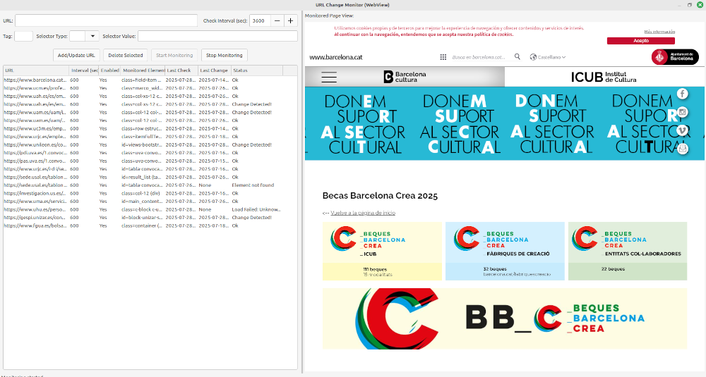

# URL_Monitor - Web Page Change Detection Tool


URL_Monitor is a WxPython desktop application that monitors web pages for changes, with special support for tracking specific HTML elements. It uses wxPython's WebView component for reliable page loading and element inspection.

## Features

- Monitor entire web pages or specific HTML elements (by ID or class)
- Configurable check intervals (from 10 seconds to 24 hours)
- Visual diff of changes through integrated WebView browser
- Desktop notifications when changes are detected
- Persistent storage of monitored URLs between sessions
- Multi-threaded monitoring that doesn't block the UI
- Detailed change history and status tracking

## Screenshot



## Installation


### Prerequisites
- Python 3.7 or higher
- wxPython 4.0 or higher (with WebView support)


### Steps
1. Clone this repository:
   ```bash
   git clone https://github.com/yourusername/url-monitor.git
   cd url-monitor

2. Install required packages:
```bash
pip install -r requirements.txt

3. Run the application:
```bash
    python url_monitor.py

## Usage

Add a URL to monitor:
Enter the full URL (e.g., https://example.com)

Set the check interval in seconds.

(Optional) Specify an HTML element to monitor:

Tag name (e.g., div, span)

Selector type (id or class)

Selector value (the actual ID or class name)

Start monitoring:

Click "Start Monitoring" to begin periodic checks

The status column will show the last check result

View changes:

When changes are detected, you'll get a desktop notification

The right panel shows the current page in WebView

The status will change to "Change Detected!"

## Configuration

The application automatically saves your monitored URLs to url_monitor_data.pkl in the same directory. To reset your configuration, simply delete this file.
Requirements

    wxPython >= 4.0.0

    requests >= 2.0.0

    beautifulsoup4 >= 4.0.0

## Known Limitations

    WebView requires a compatible backend (WebKitGTK on Linux, Edge on Windows)

    Some websites may block automated access

    Complex JavaScript-heavy pages may not be fully supported

## Contributing

Contributions are welcome! Please open an issue or submit a pull request for any improvements.

License

This project is licensed under the MIT License - see the LICENSE file for details.
URL:Monitor - Web Page Change Detection Tool
  
URL:Monitor is a WxPython desktop application that monitors web pages for changes, with special support for tracking specific HTML elements. It uses wxPython's WebView component for reliable page loading and element inspection.
Features
·	Monitor entire web pages or specific HTML elements (by ID or class)
·	Configurable check intervals (from 10 seconds to 24 hours)
·	Visual diff of changes through integrated WebView browser
·	Desktop notifications when changes are detected
·	Persistent storage of monitored URLs between sessions
·	Multi-threaded monitoring that doesn't block the UI
·	Detailed change history and status tracking
Screenshot

Installation
Prerequisites
·	Python 3.7 or higher
·	wxPython 4.0 or higher (with WebView support)
Steps
1.	Clone this repository: ```bash git clone https://github.com/yourusername/url-monitor.git cd url-monitor
2.	Install required packages: bash
pip install -r requirements.txt
1.	Run the application: bash
python url_monitor.py
Usage
1.	Add a URL to monitor:    Enter the full URL (e.g., https://example.com)    
2.	Set the check interval in seconds   
3.	 (Optional) Specify an HTML element to monitor:        Tag name (e.g., div, span)        Selector type (id or class)        Selector value (the actual ID or class name)Start monitoring:   
4.	 Click "Start Monitoring" to begin periodic checks    The status column will show the last check resultView changes:    
5.	When changes are detected, you'll get a desktop notification   
6.	 The right panel shows the current page in WebView    
7.	The status will change to "Change Detected!"
Configuration
The application automatically saves your monitored URLs to url_monitor_data.pkl in the same directory. To reset your configuration, simply delete this file. 

## Requirements
 –	wxPython >= 4.0.0
 
 –	requests >= 2.0.0
 
 –	beautifulsoup4 >= 4.0.0

## Known Limitations
WebView requires a compatible backend (WebKitGTK on Linux, Edge on Windows)

Some websites may block automated access

heavy pages with complex javascript may not be fully supported

## Contributing
Contributions are welcome! Please open an issue or submit a pull request for any improvements. 

## CLicense
This project is licensed under the MIT License - see the LICENSE file for details. 


